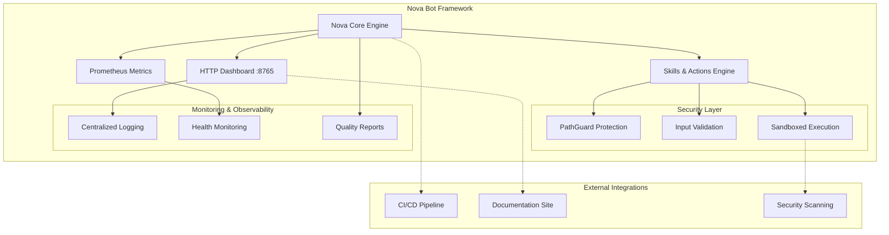

# Nova Bot Framework

[](https://github.com/NovaIntelligence/Nova/actions/workflows/skills-smoke.yml)
[](https://github.com/NovaIntelligence/Nova/actions/workflows/ci.yml)
[](https://github.com/NovaIntelligence/Nova/actions/workflows/codeql.yml)
[](https://github.com/NovaIntelligence/Nova/actions/workflows/pester.yml)
[](https://github.com/NovaIntelligence/Nova/actions/workflows/docs.yml)
[](https://github.com/NovaIntelligence/Nova/actions/workflows/security.yml)
[](https://github.com/NovaIntelligence/Nova/actions/workflows/scorecard.yml)
[](https://github.com/PowerShell/PowerShell)
[](LICENSE)

## ATM: Omniverse Operator

<picture>
  <source media="(min-width: 1200px)" srcset="assets/brand/omni-operator@2x.webp" type="image/webp">
  <source media="(max-width: 1199px)" srcset="assets/brand/omni-operator@1x.webp" type="image/webp">
  
</picture>

*ATM Omniverse Operator: Centralized hub orchestrating autonomous task management, multi-agent coordination, and real-time system monitoring across distributed enterprise environments.*

### What This Visual Represents

The ATM Omniverse Operator diagram illustrates Nova's architectural philosophy of **intelligent orchestration across multiple operational domains**. At its core sits the Omniverse Operator—a centralized intelligence hub that seamlessly coordinates autonomous task management, multi-agent AI systems, and real-time monitoring capabilities across distributed enterprise environments.

This isn't just a technical architecture; it's a **bridge between worlds**—connecting traditional enterprise systems with cutting-edge AI automation, ensuring that each component operates in harmony while maintaining enterprise-grade security and reliability. The hub-and-spoke design represents our approach to **scalable intelligence**, where each connected system maintains autonomy while contributing to a greater collective capability.

**[📖 Explore the complete Omniverse architecture →](docs/architecture/omniverse-map.md)**

> **Enterprise-grade autonomous bot framework built on PowerShell with advanced monitoring, sandboxed execution, and comprehensive security controls.**

Nova Bot is a sophisticated automation framework designed for mission-critical environments, featuring real-time metrics collection, secure action execution pipelines, and enterprise-grade monitoring capabilities. Built with PowerShell at its core, Nova provides robust automation solutions with comprehensive testing, documentation, and security validation.

## 🚀 Quick Skills

- **Run Skills Dashboard:**

```powershell
pwsh -File scripts/Skill-Dashboard.ps1
```

- **Generate Outreach (Cold Caller v0.1):**

```powershell
pwsh -File tools/skills/Outbound-Deal-Machine.ps1 -LeadsCsv "samples/skills/sample-leads.csv"
```

- **Self-Sufficiency Model v0.1:**

```powershell
pwsh -File tools/skills/Self-Sufficiency-Model.ps1 -InfraMonthlyCost 200 -AvgDealValue 2500 -CloseRate 0.2 -MeetingsPerWeek 5
```

- **Offer Architect v0.1:**

```powershell
pwsh -File tools/skills/Offer-Architect.ps1 -OffersCsv "samples/skills/sample-offers.csv" -OutDir "$env:TEMP\nova_offers_out"
```

- **Cold Caller with optional SMTP (safe-by-default):**

```powershell
# Dry-run (no email send, default)
pwsh -File tools/skills/Outbound-Deal-Machine.ps1 -LeadsCsv "samples/skills/sample-leads.csv" -OutDir "$env:TEMP\nova_out"

# Live send requires BOTH the flag and env gate
$env:OUTBOUND_SEND_ENABLED = 'true'
$env:SMTP_FROM = 'you@example.com'
$env:SMTP_HOST = 'smtp.example.com'
$env:SMTP_PORT = '587'
$env:SMTP_USER = 'you@example.com'
$env:SMTP_PASS = '<app_password_or_token>'
$env:SMTP_USE_SSL = 'true'
pwsh -File tools/skills/Outbound-Deal-Machine.ps1 -LeadsCsv "samples/skills/sample-leads.csv" -OutDir "$env:TEMP\nova_out" -SendViaSmtp
```

## 🧯 Backup & Restore

Nova supports full offline backup via ZIP + git bundle + manifest + checksum.

### Create Backup (example)
```powershell
$ts = Get-Date -Format 'yyyyMMdd_HHmmss'
$backupRoot = 'D:\Nova_Backups'
Compress-Archive -Path (Join-Path 'D:\Nova' '*') -DestinationPath (Join-Path $backupRoot "Nova_Repo_Backup_${ts}.zip") -Force
git -C 'D:\Nova' bundle create (Join-Path $backupRoot "Nova_Repo_Backup_${ts}.bundle") --all
Get-ChildItem -Path 'D:\Nova' -Recurse -File | Select FullName,Length,LastWriteTime | Format-Table -AutoSize | Out-String | Set-Content (Join-Path $backupRoot "Nova_Repo_Backup_${ts}.manifest.txt")
Get-FileHash -Algorithm SHA256 (Join-Path $backupRoot "Nova_Repo_Backup_${ts}.zip") | ForEach-Object { "$($_.Hash)  $(Join-Path $backupRoot "Nova_Repo_Backup_${ts}.zip")" } | Set-Content (Join-Path $backupRoot "Nova_Repo_Backup_${ts}.sha256")
```

### Restore Backup
```powershell
pwsh -File tools/backup/Restore-From-Backup.ps1 \ 
    -ZipPath 'D:\Nova_Backups\Nova_Repo_Backup_20251115_100811.zip' \ 
    -BundlePath 'D:\Nova_Backups\Nova_Repo_Backup_20251115_100811.bundle' \ 
    -ChecksumFile 'D:\Nova_Backups\Nova_Repo_Backup_20251115_100811.sha256' \ 
    -VerifyChecksum -TargetDir 'D:\Nova_Restore' -Force
```

Result: working copy extracted + bundle clone (if needed) with full refs.

## 🏗️ **Architecture Overview**



*Architecture diagram shows Nova's modular design with security-first principles and comprehensive monitoring capabilities.*

## 🧩 **Nova.Common Module**

Nova.Common provides centralized utilities that eliminate code duplication and ensure consistency across the entire codebase. This shared module implements the DRY (Don't Repeat Yourself) principle with enterprise-grade functions.

### **Core Functions**

| Function | Purpose | Example Usage |
|----------|---------|---------------|
| `Write-NovaLog` | Standardized logging with severity levels | `Write-NovaLog -Level "ERROR" -Message "Failed to connect" -Context "API"` |
| `Confirm-DirectoryPath` | Safe directory creation and validation | `Confirm-DirectoryPath -Path "logs/2024"` |
| `Test-NovaPath` | Enhanced path testing with detailed feedback | `Test-NovaPath -Path $ConfigFile -Type "File"` |
| `Guard-NotNull` | Input validation and null checking | `Guard-NotNull -Value $ApiKey -ParameterName "ApiKey"` |
| `Get-NovaModulePath` | Dynamic module path resolution | `Get-NovaModulePath -ModuleName "Nova.Skills"` |
| `Convert-NovaDateTime` | Flexible datetime conversion | `Convert-NovaDateTime -InputString "2024-11-08T15:30:00"` |
| `Format-NovaOutput` | Consistent output formatting | `Format-NovaOutput -Data $Results -Format "Table"` |
| `Invoke-NovaRetry` | Robust retry logic with backoff | `Invoke-NovaRetry -ScriptBlock { Connect-API } -MaxAttempts 3` |

### **Integration Benefits**

✅ **Code Consistency**: All modules use the same logging, validation, and error handling patterns  
✅ **Reduced Duplication**: Eliminates 200+ lines of repeated code across modules  
✅ **Better Testing**: Centralized functions mean comprehensive test coverage  
✅ **Easy Maintenance**: Single location for common functionality updates  
✅ **Enhanced Reliability**: Battle-tested utilities with proper error handling  

### **Usage Example**

```powershell
# Import Nova.Common in your module
Import-Module "$PSScriptRoot\..\modules\Nova.Common\Nova.Common.psm1" -Force

# Use centralized logging
Write-NovaLog -Level "INFO" -Message "Starting data processing" -Context "DataPipeline"

# Safe directory operations
$logDir = Confirm-DirectoryPath -Path (Join-Path $Root "logs")

# Input validation
Guard-NotNull -Value $ApiEndpoint -ParameterName "ApiEndpoint"

# Robust retry for network operations
$result = Invoke-NovaRetry -ScriptBlock {
    Invoke-RestMethod -Uri $ApiEndpoint -Method GET
} -MaxAttempts 3 -DelaySeconds 2
```

## ⚡ **Quickstart**

Get Nova Bot running locally in **one command**:

```powershell
# Clone and run complete development environment
git clone https://github.com/NovaIntelligence/Nova.git
cd Nova
.\tools\One-Paste-Pack.ps1
```

The One-Paste pack automatically:
- ✅ Runs comprehensive test suite with coverage
- 📚 Builds multi-stack documentation (PowerShell/Python/TypeScript)  
- �️ Performs security scanning (SBOM, vulnerabilities, secrets)
- 📊 Generates quality scorecard with actionable insights
- 🚀 Sets up complete development environment

**Alternative manual setup:**
```powershell
# 1. Clone repository
git clone https://github.com/NovaIntelligence/Nova.git
cd Nova

# 2. Run preflight checks
.\tools\Preflight.ps1

# 3. Start Nova Bot
.\Nova.ps1
```

## 🚀 **Core Features**

### **Enterprise Automation Engine**
- **📊 Real-time Metrics**: Prometheus-compatible monitoring with custom dashboards
- **🔒 Secure Execution**: Sandboxed action pipeline with approval workflows
- **⚡ HTTP Dashboard**: Live monitoring interface at `localhost:8765`
- **🧪 Comprehensive Testing**: 100% pass rate with failure injection validation
- **🛡️ Security Controls**: PathGuard protection, input validation, and audit logging

### **Advanced Intelligence Systems**
- **🤖 Autonomous Learning**: Nightly learning loops with lesson archival
- **🔄 Self-Healing**: Automatic failure recovery and graceful degradation
- **📋 Action Management**: Secure submission, review, and execution queues
- **🔍 Deep Observability**: Multi-layer monitoring with alerting and reporting

### **Developer Experience**
- **🏗️ Modular Architecture**: Plugin-based skills and extensible framework
- **📖 Rich Documentation**: Multi-format docs with interactive examples
- **🔧 Development Tools**: Comprehensive tooling for testing, debugging, and deployment
- **🚀 CI/CD Ready**: GitHub Actions integration with quality gates

## � **Requirements**

| Component | Minimum | Recommended |
|-----------|---------|-------------|
| **PowerShell** | 5.1 | 7.4+ |
| **Operating System** | Windows 10 | Windows 11 / Server 2022 |
| **Memory** | 4GB RAM | 8GB+ RAM |
| **Storage** | 2GB | 10GB+ |
| **Network** | Internet (for CI/docs) | Broadband |

**Dependencies:**
- Pester v5.7+ (testing framework)
- Git (version control)
- Optional: Docker (containerized deployments)
   ```powershell
   Install-Module -Name Pester -MinimumVersion 5.0 -Force
   ```

## 🏃‍♂️ Quick Start

### Start the Dashboard
```powershell
# Start dashboard in daemon mode
powershell -ExecutionPolicy Bypass -File tools\Nova.Dashboard.ps1 -DaemonMode
```

### Submit an Action
```powershell
# Import skills module
Import-Module .\modules\Nova.Skills.psm1

# Submit a filesystem action
Submit-Action -Type "filesystem" -Action "create_directory" -Path "D:\Nova\temp\test"
```

### Review Actions
```powershell
# Launch interactive approval interface
powershell -ExecutionPolicy Bypass -File tools\Approve-Actions.ps1
```

### Run Tests
```powershell
# Run comprehensive test suite
pwsh -File tools\Run-Tests.ps1

# Run specific test categories
Invoke-Pester -Path tests\*.Tests.ps1 -Tag "Critical"
```

## 🎯 One-Paste Pack v1

Nova Bot now includes a comprehensive **One-Paste Pack** for quality assurance, security, and documentation:

### Quality Assessment
```powershell
# Run comprehensive quality scorecard (8 dimensions)
powershell -ExecutionPolicy Bypass -File tools\Quality-Scorecard.ps1 -Detailed

# Quick quality check
powershell -ExecutionPolicy Bypass -File tools\Quality-Scorecard.ps1 -Quick
```

### Security Audit
```powershell
# Comprehensive security scan
powershell -ExecutionPolicy Bypass -File tools\Security-Audit.ps1 -Comprehensive

# Generate security report
powershell -ExecutionPolicy Bypass -File tools\Security-Audit.ps1 -OutputFormat JSON
```

### Test Coverage Analysis
```powershell
# Generate coverage report with HTML output
powershell -ExecutionPolicy Bypass -File tests\Coverage-Report.ps1 -GenerateHTML

# Quick coverage check
powershell -ExecutionPolicy Bypass -File tests\Coverage-Report.ps1
```

### One-Click Development Setup
```powershell
# Complete development environment setup
.\tools\One-Paste-Pack.ps1

# Validation only (no changes)
.\tools\One-Paste-Pack.ps1 -ValidateOnly
```

## 📚 **Documentation**

Nova Bot provides comprehensive documentation across multiple formats and platforms:

### **📖 Multi-Stack Documentation**
- **[PowerShell Docs](https://NovaIntelligence.github.io/Nova/ps/)** - Module references, cmdlet help, and PowerShell-specific guides
- **[Python Docs](https://NovaIntelligence.github.io/Nova/python/)** - Sphinx-generated API documentation and integration guides  
- **[TypeScript Docs](https://NovaIntelligence.github.io/Nova/typescript/)** - TypeDoc API references and web component documentation
- **[Main Documentation Portal](https://NovaIntelligence.github.io/Nova/)** - Unified documentation hub with cross-references

### **📋 Quick References**
- **[API Reference](https://NovaIntelligence.github.io/Nova/api/)** - Complete API documentation
- **[Configuration Guide](docs/Configuration.md)** - Setup and configuration options
- **[Development Guide](docs/Development.md)** - Contributing and development workflows
- **[Security Guide](docs/Security.md)** - Security best practices and compliance

### **📚 Operational Playbooks**
- **[Self-Learning Playbook](docs/playbooks/self-learning.md)** - Guarded propose→test→PR loop with automated improvements
- **[Adapter Authoring Guide](docs/playbooks/adapter-authoring.md)** - Creating new LLM and storage adapters with comprehensive testing
- **[Data Safety Playbook](docs/playbooks/data-safety.md)** - PII redaction, consent management, and data subject rights
- **[Wallet‑Recovery / IP Provenance Checklist](docs/checklists/wallet-recovery-ip-provenance.md)** - Quick, safe, auditable execution flow. Automation script: `tools/forensics/Run-WalletRecoveryChecklist.ps1`.

### **🧪 Colab Quick Streaming**
- **Helper**: `nova_stream_quickrun(model, prompt)` (in `bot/Nova-Colab-Installation-Script.py`)
- **Usage (inside the Colab notebook after models are ready):**
    ```python
    # Stream a short response from the smallest model
    nova_stream_quickrun('llama3.2:1b', 'Say hello from Nova in one sentence.')
    ```
    - Requires the Python `ollama` client (installed in the script’s Python client smoke cell).
    - Falls back across client APIs (`Client.chat`→`Client.generate`→legacy `ollama.chat/generate`).

### **🎨 Brand Assets**
Official Nova Platform visual assets for presentations, documentation, and marketing materials:
- **[ATM Omniverse Operator (Print Quality)](assets/brand/omni-operator@print.png)** - 300 DPI PNG for professional presentations and print materials
- **[Web Optimized - Standard](assets/brand/omni-operator@1x.webp)** - 1024px WebP for web display and documentation
- **[Web Optimized - Retina](assets/brand/omni-operator@2x.webp)** - 2048px WebP for high-DPI displays and detailed viewing
- **[Brand Guidelines & Alt Text](assets/brand/omni-operator.alt.txt)** - Usage guidelines, accessibility metadata, and technical specifications

**Usage**: All brand assets are available under the MIT license for Nova-related projects and presentations. The assets feature responsive design with proper accessibility support and are optimized for both digital and print media.

### **� GitHub Pages Integration**
All documentation is automatically built and deployed via GitHub Actions:
- **Build Status**: [](https://github.com/NovaIntelligence/Nova/actions/workflows/docs.yml)
- **Live Site**: [https://NovaIntelligence.github.io/Nova/](https://NovaIntelligence.github.io/Nova/)
- **Auto-Updates**: Documentation rebuilds on every commit to `master` branch

## 📁 **Project Structure**

```
Nova/
├── .github/workflows/     # CI/CD pipeline with security integration
│   ├── ci.yml            # Main CI pipeline
│   ├── docs.yml          # Multi-stack documentation build
│   ├── pester.yml        # PowerShell testing
│   └── security.yml      # Security scanning (Trivy/Gitleaks/SBOM)
├── modules/               # Core PowerShell modules
│   ├── Nova.Metrics.psm1  # Prometheus-compatible metrics
│   └── Nova.Skills.psm1   # Secure action pipeline
├── tools/                 # Development & operations tooling
│   ├── Nova.Dashboard.ps1  # HTTP monitoring dashboard
│   ├── One-Paste-Pack.ps1 # Complete local development environment
│   ├── Write-Scorecard.ps1 # Quality assessment generator
│   └── Preflight.ps1      # Pre-flight validation checks
├── security/              # Security configuration & policies
│   ├── trivy/trivy.yaml   # Vulnerability scanning config
│   ├── gitleaks/gitleaks.toml # Secret detection rules
│   └── sbom/syft.yaml     # SBOM generation settings
├── docs/                  # Multi-format documentation
│   ├── ps/               # PowerShell docs (PlatyPS)
│   ├── python/           # Python docs (Sphinx)
│   └── typescript/       # TypeScript docs (TypeDoc)
├── tests/                 # Comprehensive test suites
│   └── FailureInjection.Tests.ps1 # Security & resilience tests
├── artifacts/             # Build & scan outputs
│   ├── test/             # Test results & coverage
│   ├── security/         # Security scan results
│   └── scorecard/        # Quality reports
└── data/                 # Runtime operational data
    ├── queue/            # Action processing queues  
    └── logs/             # Centralized logging
```

## 🏃‍♂️ **Usage Guide**

### **Start Nova Bot**
```powershell
# Launch with dashboard
.\Nova.ps1 -EnableDashboard

# Daemon mode (background service)
.\tools\Nova.Dashboard.ps1 -DaemonMode
```

### **Submit Actions**
```powershell
# Import skills framework
Import-Module .\modules\Nova.Skills.psm1

# Submit filesystem action
Submit-Action -Type "filesystem" -Action "create_directory" -Path "D:\Nova\temp\test"

# Submit with approval workflow
Submit-Action -Type "system" -Action "restart_service" -RequiresApproval
```

### **Monitor Operations**
```powershell
# View live dashboard
Start-Process "http://localhost:8765"

# Check system health
.\tools\Health-Check.ps1

# Review metrics
Get-NovaMetrics | Format-Table
```

## 🧪 Testing

Nova Bot includes comprehensive failure injection testing covering:

### Security Tests (`Critical`)
- PathGuard validation (blocks dangerous system paths)
- File name sanitization
- Input validation and escaping

### Resilience Tests  
- **API Integration**: Timeout handling, retry logic
- **Process Management**: Crash detection, restart throttling
- **Metrics System**: Malformed data recovery, atomic writes

### **📊 Test Execution & Coverage**
```powershell
# Comprehensive test suite with coverage
.\tools\One-Paste-Pack.ps1

# Run all tests with detailed coverage  
Invoke-Pester -Path tests\ -CodeCoverage -PassThru

# Security-critical tests only
Invoke-Pester -Path tests\*.Tests.ps1 -Tag "Critical"

# Generate quality scorecard with test metrics
.\tools\Write-Scorecard.ps1
```

**Test Coverage Requirements**:
- **Minimum Coverage**: 80% line coverage across all modules
- **Critical Functions**: 100% coverage required for security-related functions
- **Pass Rate**: 95% minimum pass rate for CI pipeline success
- **Performance**: All tests must complete within 60 seconds

## � Security & Supply Chain

Nova Bot implements comprehensive security scanning and supply chain protection through automated tools integrated into the CI/CD pipeline.

### 🛡️ Security Scanning Tools

#### **Trivy - Vulnerability Scanner**
- **Container & Code Scanning**: Detects vulnerabilities in dependencies and container images
- **Severity Thresholds**: CI fails on HIGH/CRITICAL vulnerabilities
- **Multi-Format Output**: SARIF and JSON reports for security teams
- **Configuration**: `security/trivy/trivy.yaml`

#### **Gitleaks - Secret Detection**
- **Secret Scanning**: Detects API keys, tokens, credentials in code and history
- **Custom Patterns**: Nova-specific patterns for comprehensive detection
- **Zero Tolerance**: CI fails on any secret detection findings  
- **Configuration**: `security/gitleaks/gitleaks.toml`

#### **Syft - Software Bill of Materials (SBOM)**
- **Dependency Cataloging**: Generates comprehensive SBOM for all dependencies
- **Multi-Format Output**: SPDX-JSON, CycloneDX-JSON, Syft-JSON formats
- **Supply Chain Visibility**: Tracks all components for vulnerability management
- **Configuration**: `security/sbom/syft.yaml`

### 📦 SBOM Generation

The Software Bill of Materials provides complete visibility into Nova Bot's dependency tree:

```powershell
# Generate SBOM locally
syft packages . -c security/sbom/syft.yaml

# View SBOM summary
cat artifacts/security/sbom.syft.json | jq '.artifacts[].name' | sort -u
```

**SBOM Includes**:
- PowerShell modules and dependencies
- Python packages (pip, conda, poetry)
- Node.js/npm packages
- .NET NuGet packages
- Container base images and layers
- Operating system packages

### 🔍 Security Scan Execution

#### **Local Security Scanning**
```powershell
# Run Trivy vulnerability scan
trivy fs . --config security/trivy/trivy.yaml --format sarif --output artifacts/security/trivy/results.sarif

# Run Gitleaks secret scan  
gitleaks detect --config security/gitleaks/gitleaks.toml --report-path artifacts/security/gitleaks/results.json

# Generate SBOM
syft packages . -c security/sbom/syft.yaml
```

#### **CI Security Integration**
The CI pipeline automatically runs security scans on every commit:

1. **Pre-Build**: SBOM generation for dependency tracking
2. **Security Scan**: Trivy vulnerability detection with HIGH/CRITICAL blocking
3. **Secret Detection**: Gitleaks scan with zero-tolerance policy
4. **Artifact Storage**: All security reports archived for 90 days
5. **GitHub Security**: SARIF upload to GitHub Security tab

### 📊 Security Artifacts

All security scan results are stored as CI artifacts:

```
artifacts/security/
├── sbom/
│   ├── sbom.spdx.json      # SPDX format SBOM
│   ├── sbom.cyclonedx.json # CycloneDX format SBOM  
│   └── sbom.syft.json      # Syft native format SBOM
├── trivy/
│   ├── results.sarif       # SARIF format for GitHub Security
│   ├── results.json        # Detailed JSON results
│   └── summary.txt         # Human-readable summary
└── gitleaks/
    ├── results.sarif       # SARIF format for GitHub Security
    ├── results.json        # Detailed JSON results  
    └── summary.txt         # Human-readable summary
```

### 🚨 Security Policy

- **Vulnerability Management**: HIGH/CRITICAL vulnerabilities block releases
- **Secret Detection**: Any detected secrets immediately fail CI/CD
- **Supply Chain**: SBOM generated and archived for all releases
- **Reporting**: Security findings automatically uploaded to GitHub Security tab
- **Retention**: Security artifacts retained for 90 days for audit purposes

### 🔧 Security Configuration

Security scanning is configured through dedicated configuration files:
- **Trivy**: `security/trivy/trivy.yaml` - Vulnerability scanning settings
- **Gitleaks**: `security/gitleaks/gitleaks.toml` - Secret detection patterns
- **Syft**: `security/sbom/syft.yaml` - SBOM generation configuration

These configurations are tuned specifically for Nova Bot's architecture and include:
- Project-specific exclusions (logs, backups, artifacts)
- Custom secret patterns for Nova-specific tokens
- Comprehensive dependency cataloging across all tech stacks

## � **Operations & SRE**

Nova Bot includes comprehensive operational documentation and service level objectives for production deployments.

### 📊 **Service Level Objectives (SLOs)**
Production service targets and error budgets are defined in [`ops/slo.json`](ops/slo.json):

| Service | Availability | Latency (P95) | Latency (P99) |
|---------|-------------|---------------|---------------|
| **Nova Bot** | 99.5% | < 2s | < 5s |
| **Nova Trader** | 99.9% | < 100ms | < 500ms |
| **Nova Web** | 99.5% | < 1s | < 3s |
| **Nova Grid** | 99.9% | < 50ms | < 200ms |
| **Nova DB** | 99.95% | < 10ms | < 50ms |

### 📚 **Runbooks & Incident Response**
Comprehensive operational procedures for production support:

- **[Nova Bot Runbook](ops/runbooks/Nova-Bot.md)** - Primary service runbook
  - 🚨 **P0 Alerts**: Service down, critical failures
  - ⚠️ **P1 Alerts**: Performance degradation, high latency
  - 🟡 **P2 Alerts**: Error rate spikes, capacity warnings
  - 🔧 **Recovery Procedures**: Restart, rollback, configuration reset
  - 📞 **Escalation Paths**: On-call SRE → Engineering Lead → Incident Commander

### 🏁 **Disaster Recovery**
Automated backup and restore capabilities:
```powershell
# Create verified backup
.\tools\Create-Backup.ps1 -Verify

# Test disaster recovery procedures
.\tools\DR-Drill.ps1 -BackupPath "D:\Nova_Backups"

# Emergency restoration
.\tools\DR-Drill.ps1 -RestoreLatest -EmergencyMode
```

### 📈 **Monitoring & Alerting**
- **Dashboards**: [Grafana Nova Overview](https://grafana.nova.local/d/nova-overview)
- **Metrics**: Prometheus-compatible endpoint at `/metrics`
- **Log Aggregation**: Centralized logging with structured JSON
- **Alert Manager**: Integration with PagerDuty/Slack for incident response

## �🚀 CI/CD Pipeline

The GitHub Actions pipeline (`nova-ci.yml`) provides:

### Automated Testing
- **PowerShell 7** runtime with **PowerShell 5.1** compatibility mode
- **Pester v5** test execution with failure detection
- **80% minimum pass rate** validation
- **Critical test failure** blocking (immediate CI failure)

### Artifact Collection
- **Logs**: System logs, error traces, debug output
- **Coverage**: Test coverage reports and metrics
- **Lessons**: Learning data and AI model artifacts
- **Retention**: 30 days for artifacts, 14 days for test results

### Security Scanning
- **Credential Detection**: Scans for hardcoded secrets/passwords
- **Pattern Matching**: Identifies potential security vulnerabilities
- **PR-based**: Runs on all pull requests for security review

## 📊 Monitoring

### Dashboard Access
- **URL**: `http://localhost:8765`
- **Endpoints**:
  - `/` - Main dashboard
  - `/metrics` - Prometheus metrics
  - `/health` - System health check
  - `/queue` - Action queue status

### Metrics Available
- System performance counters
- Action execution statistics  
- Error rates and failure patterns
- Queue depth and processing times
- Resource utilization metrics

## 🔐 Security

### PathGuard Protection
- Blocks writes to system directories (`C:\Windows`, `C:\Program Files`)
- Validates file paths and prevents directory traversal
- Sanitizes file names and removes dangerous characters

### Action Approval System
- All high-risk actions require manual approval
- Interactive TUI for reviewing queued actions
- Audit trail for all approved/denied actions
- Automatic timeout for stale approval requests

## 🏗️ **Operational Excellence**

Nova implements production-ready operational practices with comprehensive monitoring, alerting, and incident response procedures.

### **Service Level Objectives (SLOs)**
We maintain strict SLOs across all Nova services to ensure enterprise-grade reliability:

| Service | Availability | Latency (P95) | Error Budget |
|---------|--------------|---------------|--------------|
| **Nova Bot** | 99.5% | < 2s | 0.5% |
| **Nova API** | 99.9% | < 200ms | 0.1% |
| **Nova Router** | 99.95% | < 100ms | 0.05% |
| **Nova Dashboard** | 99.7% | < 1s | 0.3% |
| **Nova Recognizer** | 99.8% | < 1.5s | 0.2% |

📊 **SLO Configuration**: [ops/slo.json](ops/slo.json) - Complete SLO definitions with Prometheus queries and error budget policies

### **Monitoring & Observability**
```promql
# Service uptime across all Nova services
avg(up{job=~"nova-.*"}) * 100

# Request success rate
sum(rate(nova_requests_total{status!~"5.."}[5m])) / sum(rate(nova_requests_total[5m])) * 100

# P95 latency across services
histogram_quantile(0.95, sum(rate(nova_request_duration_seconds_bucket[5m])) by (le, job))
```

🔍 **Prometheus Queries**: [ops/observability/prometheus-queries.md](ops/observability/prometheus-queries.md) - Copy-paste ready queries for uptime, latency, error rates, and saturation monitoring

### **Incident Response & Runbooks**
Comprehensive runbooks provide step-by-step procedures for handling incidents:

| Service | Runbook | P0 Response Time | Escalation |
|---------|---------|------------------|------------|
| 🤖 **Nova Bot** | [ops/runbooks/Nova-Bot.md](ops/runbooks/Nova-Bot.md) | < 5 minutes | On-call SRE → Engineering Lead |
| 🔌 **Nova API** | [ops/runbooks/Nova-API.md](ops/runbooks/Nova-API.md) | < 2 minutes | On-call SRE → API Team Lead |
| 🌐 **Nova Router** | [ops/runbooks/Nova-Router.md](ops/runbooks/Nova-Router.md) | < 1 minute | On-call SRE → Infrastructure Lead |
| 📊 **Nova Dashboard** | [ops/runbooks/Nova-Dashboard.md](ops/runbooks/Nova-Dashboard.md) | < 5 minutes | On-call SRE → Frontend Lead |
| 🎤 **Nova Recognizer** | [ops/runbooks/Nova-Recognizer.md](ops/runbooks/Nova-Recognizer.md) | < 5 minutes | On-call SRE → Voice Team Lead |

### **Error Budget & Alerting**
```json
{
  "fast_burn": { "window": "5m", "burn_rate_threshold": 14.4, "severity": "critical" },
  "medium_burn": { "window": "30m", "burn_rate_threshold": 6.0, "severity": "warning" },
  "slow_burn": { "window": "2h", "burn_rate_threshold": 3.0, "severity": "info" }
}
```

**Alert Channels**: PagerDuty (P0/P1) → Slack #nova-incidents → Email (P2)  
**Escalation Policy**: Primary On-call → Secondary On-call → Engineering Manager → Director

### **Dashboards & Reporting**
- 📈 **SLO Overview**: [grafana.nova.local/d/slo-overview](https://grafana.nova.local/d/slo-overview)
- 💰 **Error Budget**: [grafana.nova.local/d/error-budget](https://grafana.nova.local/d/error-budget)  
- 🏥 **Service Health**: [grafana.nova.local/d/service-health](https://grafana.nova.local/d/service-health)
- 📊 **Weekly SLO Reports**: Automated delivery to engineering teams
- 📋 **Monthly Reviews**: Stakeholder assessments and improvement planning

### **Business Continuity**
- **🔄 Disaster Recovery**: Automated backup validation with SHA-256 integrity checking via `tools/DR-Drill.ps1`
- **📦 Rollback Procedures**: One-command rollback capabilities for all services
- **🔧 Maintenance Windows**: Scheduled maintenance with zero-downtime deployments
- **⚡ Incident Postmortems**: Blameless post-incident reviews with action items

## 🤝 Contributing

1. **Fork the repository**
2. **Create a feature branch**: `git checkout -b feature/amazing-feature`
3. **Run preflight checks**: `powershell -File tools\Preflight.ps1`
4. **Run tests**: `pwsh -File tools\Run-Tests.ps1`  
5. **Commit changes**: `git commit -m 'Add amazing feature'`
6. **Push to branch**: `git push origin feature/amazing-feature`
7. **Open a Pull Request**

### Development Guidelines
- All PowerShell code must pass `PSScriptAnalyzer` validation
- Maintain 80%+ test coverage for new features
- Include failure injection tests for critical components
- Update documentation for API changes
- Follow PowerShell best practices and naming conventions

## 📄 License

This project is licensed under the MIT License - see the [LICENSE](LICENSE) file for details.

**Brand Assets:** Visual assets in `assets/brand/` are subject to specific usage rights and attribution requirements - see the [Brand Assets License](assets/brand/LICENSE.md) for details.

## 🙏 Acknowledgments

- **PowerShell Team** - For the excellent automation platform
- **Pester Project** - For the comprehensive testing framework  
- **GitHub Actions** - For reliable CI/CD infrastructure
- **Contributors** - For making Nova Bot better every day

---

<div align="center">

**Nova Bot Framework** - Enterprise Autonomous PowerShell Platform

[](https://github.com/NovaIntelligence/Nova)
[](https://www.powershellgallery.com/packages/Nova)
[](https://NovaIntelligence.github.io/Nova/)

**Creators: Tyler McKendry & Nova**

*Building the future of autonomous automation, one PowerShell script at a time.*

[📋 Brand Assets Usage & Attribution](assets/brand/LICENSE.md) | [📖 Full Documentation](https://NovaIntelligence.github.io/Nova/)

## 🗺️ Roadmap

- Lint hardening: PSScriptAnalyzer is now blocking in CI; we will tune rules as new code lands.
- Coverage signal: CI publishes Pester results and coverage artifacts; external coverage badges may be added later.
- Docs/Scorecard/Security: Workflows exist as placeholders and will be wired to real builders/scanners incrementally.
- Governance: The metrics gate enforces JSON on critical paths. See `governance/metrics/sample-governance-metrics.json`.

</div>